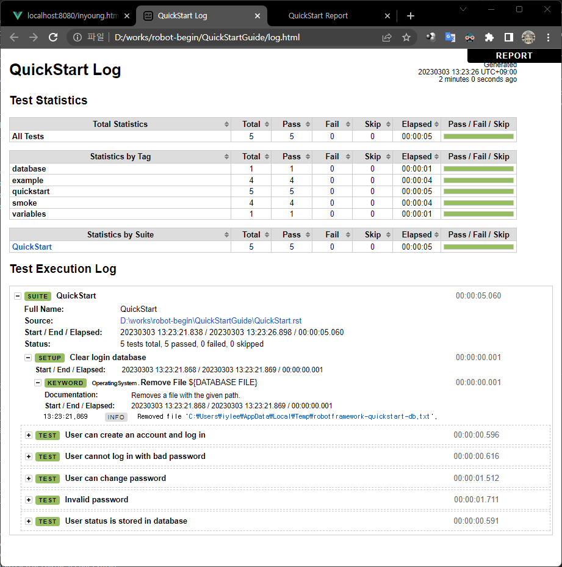
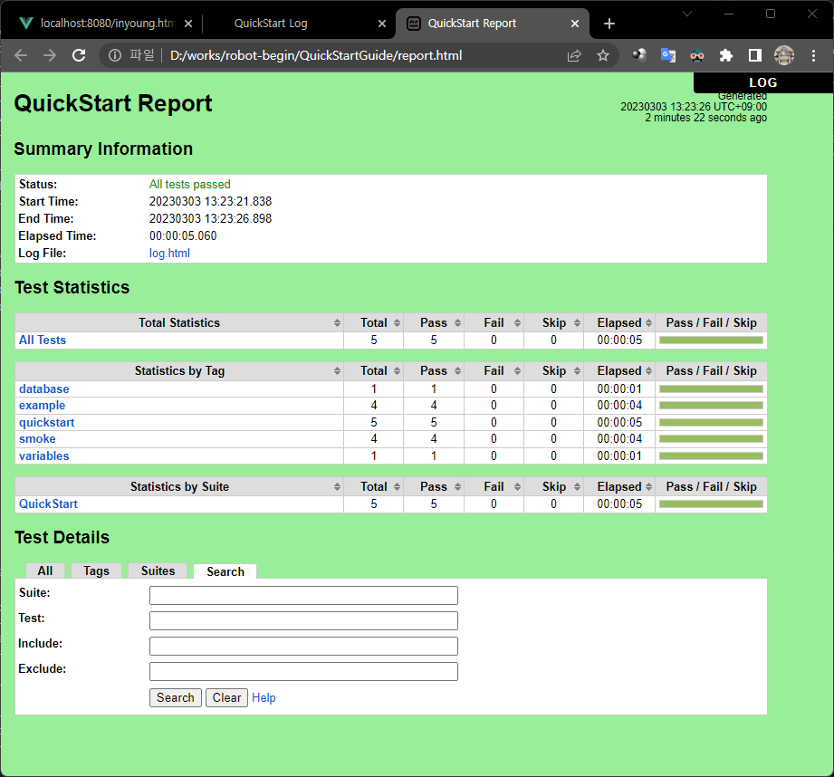
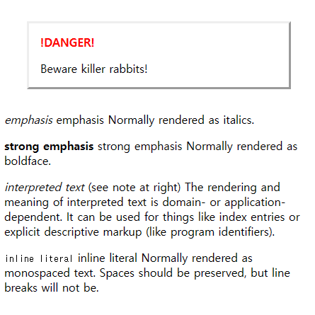

# robot-begin

<!-- toc -->
## 목차 (Table of content)

(* markdown-toc로 생성됨)

- [*) 시작](#-%EC%8B%9C%EC%9E%91)
- [*) Quick Start Guide](#-quick-start-guide)
  - [한국어 지원 테스트](#%ED%95%9C%EA%B5%AD%EC%96%B4-%EC%A7%80%EC%9B%90-%ED%85%8C%EC%8A%A4%ED%8A%B8)
- [reStructuredText](#restructuredtext)
  - [문법 및 Markdown 과의 관계](#%EB%AC%B8%EB%B2%95-%EB%B0%8F-markdown-%EA%B3%BC%EC%9D%98-%EA%B4%80%EA%B3%84)
  - [pdf, html 생성 (sphinx를 이용)](#pdf-html-%EC%83%9D%EC%84%B1-sphinx%EB%A5%BC-%EC%9D%B4%EC%9A%A9)
  - [latex 설치 (basic-miktex-22.10-x64.exe)](#latex-%EC%84%A4%EC%B9%98-basic-miktex-2210-x64exe)
  - [perl 설치 (strawberry-perl-5.32.1.1-64bit.msi)](#perl-%EC%84%A4%EC%B9%98-strawberry-perl-53211-64bitmsi)

<!-- /toc -->

## *) 시작

[https://robotframework.org/robotframework/latest/RobotFrameworkUserGuide.html#getting-started]

on windows 11

```cmd
### check python
> python –version
Python 3.10.10

### Python 3.3 버전 이상부터 virtualenv가 내장되어
### 다음과 같이 수행하면 된다.
> python -m venv env
> env\Scripts\activate
```

- install robotframework by pip

```cmd
(env) PS D:\works\robot-begin> pip install robotframework
Collecting robotframework
  Downloading robotframework-6.0.2-py3-none-any.whl (658 kB)
     ━━━━━━━━━━━━━━━━━━━━━━━━━━━━━━━━━━━━━━━━ 658.7/658.7 kB 10.3 MB/s eta 0:00:00
Installing collected packages: robotframework
Successfully installed robotframework-6.0.2

[notice] A new release of pip available: 22.3.1 -> 23.0.1
[notice] To update, run: python.exe -m pip install --upgrade pip

### 설치 확인

> robot --version
Robot Framework 6.0.2 (Python 3.10.10 on win32)

```

- docutils 설치 (reStructuredText markup language)

```cmd
> pip install docutils
```

## *) Quick Start Guide

[https://github.com/robotframework/QuickStartGuide/blob/master/QuickStart.rst]

- submodule 등록

```cmd
> git submodule add -b master https://github.com/robotframework/QuickStartGuide.git
```

- 데모 어플리케이션 (demo application)

    1. 계정 생성

        ```cmd
        > python sut/login.py create fred P4ssw0rd
        SUCCESS
        ```

    2. 로그인

        ```cmd
        python sut/login.py login fred P4ssw0rd
        Logged In
        ```

    3. 로그인 실패

        ```cmd
        > python sut/login.py login nobody P4ssw0rd
        Access Denied
        ```

    4. 패스워드 변경

        ```cmd
        > python sut/login.py change-password fred wrong NewP4ss
        Changing password failed: Access Denied
        
        > python sut/login.py change-password fred P4ssw0rd short
        Changing password failed: Password must be 7-12 characters long
        
        > python sut/login.py change-password fred P4ssw0rd NewP4ss
        SUCCESS
        ```

- 실행

```cmd
(env) PS D:\works\robot-begin> pip install docutils
Collecting docutils
  Downloading docutils-0.19-py3-none-any.whl (570 kB)
     ━━━━━━━━━━━━━━━━━━━━━━━━━━━━━━━━━━━━━━━━ 570.5/570.5 kB 9.0 MB/s eta 0:00:00
Installing collected packages: docutils
Successfully installed docutils-0.19
(env) PS D:\works\robot-begin> cd .\QuickStartGuide\
(env) PS D:\works\robot-begin\QuickStartGuide> robot QuickStart.rst  
==============================================================================
QuickStart
==============================================================================
User can create an account and log in                                 | PASS |
------------------------------------------------------------------------------
User cannot log in with bad password                                  | PASS |
------------------------------------------------------------------------------
User can change password                                              | PASS |
------------------------------------------------------------------------------
Invalid password                                                      | PASS |
------------------------------------------------------------------------------
User status is stored in database                                     | PASS |
------------------------------------------------------------------------------
QuickStart                                                            | PASS |
5 tests, 5 passed, 0 failed
==============================================================================
Output:  D:\works\robot-begin\QuickStartGuide\output.xml
Log:     D:\works\robot-begin\QuickStartGuide\log.html
Report:  D:\works\robot-begin\QuickStartGuide\report.html
```

*) log.html

QuickStartGuide_log.png


*) report.html

QuickStartGuide_report.png


*) See statemachine.py for an example of a Python module fully documented using reStructuredText.

./statemachine.py

*) rst preview 를 위해 vscode에 extension 설치

- reStructuredText 설치
- reStructuredTest Syntax highlighting
- docutils 설치

### 한국어 지원 테스트

- QuickStart.rst 를 QuickStart_ko.rst 로 복사하여 변경하면서 동작 테스트 작업

  ```cmd
  > robot .\QuickStart_ko.rst
  ```

  - 지원 잘됨
  - QuickStart_ko.rst 를 편집하면서
    - 구조 파악
    - 아래 directives 를 알고 싶어서

      ```reStructuredText
      .. code:: robotframework

          *** Test Cases ***

      ### 그런데 아래를 알려줌
      ### [https://docutils.sourceforge.io/docs/ref/rst/directives.html]

      .. DANGER::
          Beware killer rabbits!
      ```

    - 위 DANGER의 rendering 결과를 보기 위해
      - This directive might be rendered something like this:

        ```txt
        +------------------------+
        |        !DANGER!        |
        |                        |
        | Beware killer rabbits! |
        +------------------------+
        ```

      - rst에 대한 검토 및 관련 기술 습득 (다음장 reStructuredText 참고)

## reStructuredText

reStructuredText는 쉽게 읽고 사용할 수 있는 플레인 텍스트 마크업 구문 및 파서 시스템입니다. 인라인 프로그램 문서 (예 : Python docstring), 간단한 웹 페이지 및 독립 문서 작성에 유용하며, 특정 응용 프로그램 도메인에서 확장성을 위해 설계되었습니다.

reStructuredText의 주요 목표는 Python docstring 및 다른 문서 도메인에서 사용하기 위한 마크업 구문을 정의하고 구현하는 것입니다. 이 구문은 읽기 쉽고 간단하면서도 복잡한 사용에도 충분히 강력한 것이 목적입니다. 마크업의 목적은 reStructuredText 문서를 유용한 구조화된 데이터 형식으로 변환하는 것입니다.

예제로는

statemachine.py

- 다음과 같이 수행하면 html을 얻을 수 있다.

  ```cmd
  ### virtualenv 활성화
  > env\Scripts\activate
  
  ### 일단 docutils를 설치 (아마 설치되어 있을 것이다.)
  > pip install docutils
  
  ### rst2html 수행
  > python env\Scripts\rst2html.py statemachine.py > statemachine.html
  ```

- rst_test.rst 를 테스트로 작성 중인데 이를 통해서 html 출력을 테스트해보는 것이 아마 더 도움이 될 것이다.

  ```cmd
  > python env\Scripts\rst2html.py rst_test.rst > rst_test.html
  ```

  - 결과

    

### 문법 및 Markdown 과의 관계

[https://docutils.sourceforge.io/rst.html]

- markdown은 문서 작성 및 html로 빠르게 표현하는 중점을 두었고
- rst는 좀 더 복잡한 문서 작성 및 python docstring 과 같은 프로그래밍 문서화에 특화되어 있다.
  - 또한 다양한 문서 형태로 변환가능하다.

### pdf, html 생성 (sphinx를 이용)

on windows

```cmd
### sphinx를 vitualenv 환경에 설치
> pip install sphinx

### 빠르게 시작하기 (아래 명령을 실행하면 경로,저자,언어 등등을 물어보고 설정을 구성한다.)
> sphinx-quickstart

### html 생성 -> 잘됨
> make.bat html

### pdf 생성 -> latex, perl 을 설치하여야 한다.
> make.bat latexpdf

### 위 명령 실행 시 다음 오류가 발생할 수 있다.
### "latexmk 명령어 없음"
### latex 설치로 해결
### "latexmk"는 perl로 구현되어있어 perl 설치 필요
```

### latex 설치 (basic-miktex-22.10-x64.exe)

[https://miktex.org/download]

```cmd
### 설치 확인
> latex --version   
MiKTeX-pdfTeX 4.14 (MiKTeX 23.1)
```

### perl 설치 (strawberry-perl-5.32.1.1-64bit.msi)

- `https://www.perl.org/get.html`
- `https://strawberryperl.com/`

```cmd
### 설치 확인
> perl --version
This is perl 5, version 32, subversion 1 (v5.32.1) built for MSWin32-x64-multi-thread
Copyright 1987-2021, Larry Wall
```
